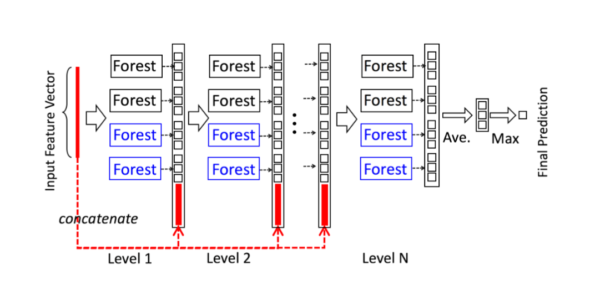
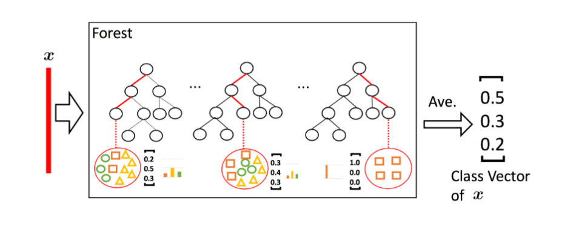
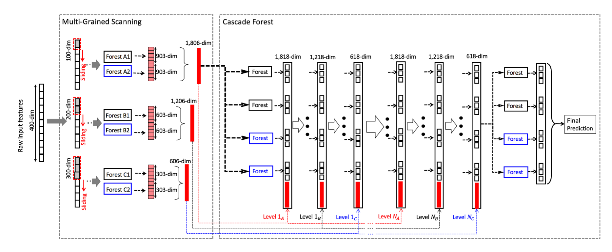

# Deep Forest:christmas_tree:

### 简介:ticket:

用**深度神经网络(DNN)**的思路来组织**随机森林(RF)**，极大地提高了随机森林的准确率

### 安装:wrench:

~~~shell
pip install deep-forest
~~~

### 函数:funeral_urn:

用法详见**测试代码**

* **deepforest.CascadeForestClassifier**：对**Deep Forest**的实现；

* **deepforest.DecisionTreeClassifier**：**Deep Forest**的树的实现；

    

### 注意事项

分类的类别需从**0**开始标记，即**label={0,1,2...}**

### 原[论文](https://arxiv.org/pdf/1702.08835.pdf)阅读:page_with_curl:

#### background

* 对**深度神经网络(DNN)**成功的原因分析：

    1. 一层一层的堆叠（*layer-by-layer processing*）；
    2. 模型内部的数据表征方式的转变【例如LSTM中**词向量**的传递和维度变化】（*in-model feature transformation*）；
    3. 足够的模型复杂度（*sufficient model complexity*）；

* **DNN**的缺陷：

    1. 超参数太多（too many hyper-parameters），模型表现十分依赖参数选择和训练（parameter tuning）；
    2. 需要大量训练数据（a huge amount of training data）；
    3. **黑箱系统**（玄学），很难进行理论分析（theoretical analysis）；
    4. 模型结构的确定先于模型训练；

    

#### inspiration

**从DNN**：

* 从**DNN**中观察到，在**DNN**每层的传播中，**数据特征（feature）**越来越集中，越来越抽象。

* **DNN**的成功和**模型复杂度**关系不大，否则*为什么无限扩大模型参数量并不能提升模型效果？*；
* **DNN**的层次性和**决策树**的层次性不一样：
    * **决策树**始终利用的是输入的数据，并没有对**数据表征（feature）**做出任何改变（work on the original feature representation），没有出现（*in-model feature transformation*）；
    * **DNN**每一层的输出都会对**数据表征（feature）**做出改变；

**从集成学习（Ensemble Learning）**

* 要做好集成学习，每个**学习单元（learner）**要做到**准确（accurate）** **多样（diverse）**；

* 实践中常常会通过技巧提高模型的**多样性**：

    * **数据采样（data sample manipulation）**：

        从原始数据集中采样出不同的**子训练集**来训练不同的**学习单元（learner）**；

        例如：

        **Bagging**中的**bootstrap sampling**；

        **AdaBoost**中的**sequential importance sampling**；

    * **输入特征采样（input feature manipulation）**：

        从原始的数据特征中采样出不同的子特征（feature）生成**子空间（subspace）**，训练不同的**学习单元（learner）**；

    * **学习参数区别（learning parameter manipulation）**：

        不同的**学习单元（learner）**采用不同的参数训练；

    * **输出表征区别（output representation manipulation）**：

        对不同的学习单元使用不同的**表征（representation）**；

#### gcForest

**层次森林结构（Cascade Forest Structure）**

* 每一层从其前面的层获取数据，再将数据传递到下一层；

* 每一层都是**随机森林**的集成；

* 每个森林中的树个数作为超参数；

* 图中：

    * 黑色森林是**随机森林（random forest）**；

        每个森林包括500棵**随机树**，树的每个节点从随机选择的$\sqrt{d}$（d是特征个数）个**候选特征**中按照**gini**系数选择一个特征来切分；

    * 蓝色森林是**完全随机树森林（completely-random tree forest）**；

        每个森林包括500棵**完全随机树**，树的每个节点会从**所有的特征**中选择一个特征切分出来，树生长直到完全是叶子；

    * 假设数据分为三类，每个**随机森林**将输出**三维向量**，然后将所有向量连接（concatenate）作为输出；

* 每个**随机森林**的输出是所有树的平均，如下图：

* 为了减小**过拟合（overfitting）**风险，每个**随机森林**的输出都使用**K折交叉验证（k-fold cross validation）**：

    * 每个条数据会被训练*k-1*次，生成*k-1*个向量，然后平均作为该树的输出；
    * 交叉验证的结果作为判定条件，如果模型效果相对上一层有提高则继续扩展下一层，否则结束；

**卷积特征提取（Multi-Grained Scanning）**

* 用一个一维或者二维的窗口扫描原数据，将窗口数据提取出来作为**新特征**；
* 将**新特征**送入训练，再将结果连接起来，作为最终的输出结果；

* 有可能某些**新特征**与结果丝毫没有关系（例如：需要识别一张图片的*汽车*，但提取出来的小片段不包含任何相关内容），这时，可以把**新特征**看成一种**output representation manipulation**，可以提高模型的多样性；

* 当**新特征**太多时，可以对其进行**采样**；

* 模型中通常使用不同大小的窗口进行特征提取，如下图：

    

### [代码](https://github.com/baowj-678/Machine-Learning/tree/master/Deep-Forest)